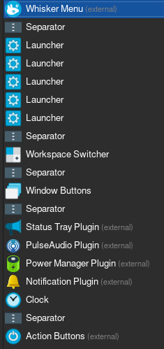

# Arch installation

*2022-02-24*

Arch reinstall on my laptop. First time using xfce4/lightdm.

This is mainly for myself and are the stuff/apps/tweaks that I always end up doing and have been getting used to. It's not a complete guide.

# Installation

## Download and write to usb

### Arch resources

- https://wiki.archlinux.org/title/Installation_guide
- https://archlinux.org/download/

### usbimager

Rufus-like for linux, download zip, extract and run as root.

  - https://gitlab.com/bztsrc/usbimager

Or just use dd, cat or something else to run image.

## Prepwork

- Change keyboard layout
- Prep disks

```
loadkeys se-latin1
```

fdisk, t for type, linux swap and linux filesystem

mkfs.ext4 /dev/nvmexxxx
mkswap /dev/nvmexxxx

Mount before install:

```
mount /dev/nvme[root] /mnt
mount /dev/nvme[esp] /mnt/boot
swapon /dev/nvme[swap]
```

## Actual install

- Check network and mirrors
- Install base packages

In case downloads is slow, update to a more local mirrorlist:

```
reflector -c 'Sweden' > /etc/pacman.d/mirrorlist
```


```
pacstrap /mnt base linux linux-firmware base-devel zsh grub efibootmgr os-prober networkmanager man-db man-pages texinfo vi vim terminator ttf-fira-code
```

| Package/s | Why |
| --------- | --- |
| base, linux, linux-firmware | Essential |
| base-devel | Mainly to use makepkg to install AUR packages. |
| zsh | My main shell. |
| grub, efibootmgr, os-prober | To install grub or generate config. |
| networkmanager | My choice of network daemon. |
| man-db, man-pages, texinfo | Essential to me at least. |
| vi, vim | My main text editors. |
| terminator | My main terminal. |

Other packages that I always install when OS is up and running are found under [Applications](#Applications).

## Pre-reboot

Set up enviroment:

```
# Will generate a new fstab based on root from /mnt
genfstab -U /mnt >> /mnt/etc/fstab

# Chroot to make adjustments
arch-chroot /mnt

# Configure timezone
ln -sf /usr/share/zoneinfo/Europe/Stockholm /etc/localtime

# Set hardware clock
hwclock --systohc

# Uncomment sv_SE and en_US in /etc/locales.gen
# Generate locales
locale-gen
```

Edit '/etc/vconsole.conf':

```
KEYMAP=sv-latin1
```

### GRUB config

If the partioning messed up your grub config, changing layout or UUIDs, make a new one.

I had an existing esp with grub on it so I only had to generate a new config.

Edit the file '/etc/default/grub' and uncomment the line 'GRUB_DISABLE_OS_PROBER=false'.

Run command:

```
grub-mkconfig -o /boot/grub/grub.cfg
```

### Change root password

Will lock this account later when working sudo is confirmed.

```
passwd root
exit
reboot
```

# Post-instalation

## Network and time

Enable Network Manager:

```
systemctl enable NetworkManager
systemctl start NetworkManager
```

## Users and groups

```
useradd -s /usr/bin/zsh -m USERNAME
groupadd sudo
usermod -a -G sudo
passwd USERNAME
visudo
# Allow sudo group.
```

Log in as user, use zsh guide.

Try sudo and lock root.

```
sudo -l
sudo passwd -l root
```

## Graphics and Sound

### Desktop environment and Display Manager

```
sudo pacman -S xf86-video-intel xorg-server xfce4 xfce4-goodies lightdm lightdm-gtk-greeter network-manager-applet
sudo systemctl enable lightdm
reboot
```

Can be started with `startxfce4`.

### Hybrid graphics

Due to my laptop having to graphic cards(intel/cpu and nvidia) and linux not having full support. Using optimus-manager to switch manually seems to be the most stable choice.

- https://wiki.archlinux.org/title/NVIDIA
- https://wiki.archlinux.org/title/Bumblebee
- https://github.com/Askannz/optimus-manager
- https://aur.archlinux.org/packages/optimus-manager
- https://aur.archlinux.org/packages/optimus-manager-qt


Install from AUR. Add app launcher to panel for qt.

### Sound

- https://wiki.archlinux.org/title/sound_system

```
sudo pacman -S pulseaudio pavucontrol
```

# Applications
My main applications

```
sudo pacman -S firefox flameshot git caprine discord xclip zsh-syntax-highlighting zsh-autosuggestions atom virtualbox virtualbox-host-modules-arch virtualbox-guest-iso smbclient wget galculator xreader
```

Above packages saved in 'resouces/paclist.txt'. Use with `pacman S - < paclist.txt`.

Reboot to load new kernel modules.

# Tweaking

## XFCE general
Something went wrong with my locales so I had to `echo LANG=sv_SE.UTF-8 > /etc/locale.conf`.

- Theme to adwaita-dark.
- Change keyboard layout in xfce, remove enlish, add swedish.
- Tap touchpad to click.
- Set default terminal to terminator and firefox.
- Bind META+ARROWS and others to move current window(window manager).
- Window tweaks - Check that compositing is enabled.
- Keyboard - Bind Super+ARROWS to tiling windows.
- Focus - follows mouse
- Appearance - Font - DPI = 110
- Changed monospace font to fira code(10) and font to cantarell(11).

Custom themes and icons location:

```
~/.local/share/themes
~/.icons
/usr/share/fonts
~/.fonts
```

- https://www.xfce-look.org/

### XFCE Panel settings

Bind `xfce4-popup-whiskermenu` to 'Super L + CTRL'.



Launchers:
- Web browser
- File Manager
- Terminal
- Atom
- VirtualBox

## Apps

**Firefox**

Bookmarks always show, dark theme, login.

**Atom**

Markdown packages:
- language markdown
- markdown-writer
- markdown-img-paste
- markdown-preview-plus

Don't restore on start: Check 'Core - Open Empty Editor On Start' and set 'Core - Restore Previous Windows On Start' to 'no'.

If spell-check throws an error, check locales under the package settings, set to 'en-US' if blank.

**Flameshot**

Bind 'Super L + Shift + S' to `flameshot gui`.

## Configuration files

These files are located in the configs folder.

Terminator config colors and zsh config honestly stolen from/inspired by kali.

**Terminator** - copy to `~/.config/terminator/config`

**vim** - copy to `/etc/vimrc`

**zshrc** - copy to `~/.zshrc`

The config assumes that 'zsh-syntax-highlighting' and 'zsh-autosuggestions' is installed.

Make backups of old configs first!

Had some trouble with the fonts in terminal, copied from kali ('/usr/share/fonts/*').

## GRUB looks and feel

'bg.png' and 'grub' from '/etc/default/grub' in resources folder.

- Removing quiet boot
- Background image(linux kernel)
- Set resolution

## lightdm looks and feel

'bg.jpg' and 'lightdm-gtk-greeter.conf' located in resources, paths:
- `/etc/lightdm/`
- `/usr/share/pixmaps/`

```
sudo cp resources bg.jpg /usr/share/pixmaps/ && sudo chmod 644 /usr/share/pixmaps/bg.jpg

[greeter]
background=/usr/share/pixmaps/arch-bg.png
```

## Snapd and spotify

Easiest way to use spotify right now is to install snapd.

- https://aur.archlinux.org/packages/snapd

Reboot after installing package.

```
reboot
sudo systemctl enable snapd
sudo systemctl start snapd
snap find spotify
snap install spotify
```

## Bluetooth
```
sudo pacman -S bluez bluez-utils pulseaudio-bluetooth
reboot
sudo systemctl start bluetooth
bluetoothctl
```

bluetoothctl

```
default-agent
power on
scan on
pair MAC_ADDRESS
connect MAC_ADDRESS
```
