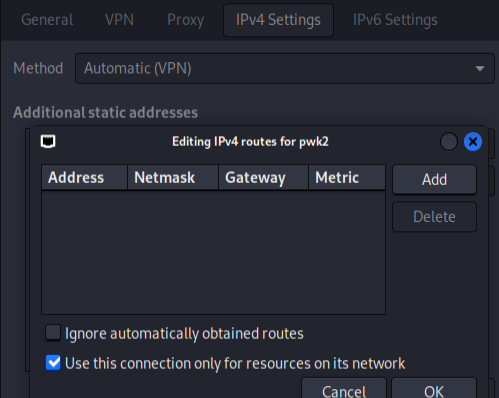

# My kali virtualbox setup

My basic kali setup whenever I have to create it from scratch. Should take less than 30mins with import and upgrading.

- https://www.kali.org/get-kali/#kali-virtual-machines

## Import

Import the downloaded image, change name, modify cpu and memory allocation.

## Initial setup

Start the VM, default credentials are kali/kali.

Under keyboard settings, delete english and add your own.

Update the system.

```
sudo apt update; sudo apt upgrade -y
# This throws an dependency error in the 2022.1 image. Try this:
sudo apt full-upgrade --auto-remove
```

While it's upgrading, change basic settings:

```
# Change local timezone
sudo ln -sf /usr/share/zoneinfo/Europe/Stockholm /etc/localtime

# A bunch of folders I'm used to
mkdir tmp opt tools machines vboxshare repos

# Give kali user permissions to use vbox shares
usermod -a -G vboxsf kali

# vi-mode for zsh
echo "bindkey -v" >> .zshrc

# change password for user
passwd kali
```

- Change window mode to scaled(vbox).
- Change Focus to follow mouse(xfce-window manager).

```
shutdown now
```

Connect shares to folders.

Excellent time to take a snapshot.

## Applications

### From repos

```
sudo apt install $(cat apt-pkg.txt)
```

- Use vim config in resources folder, copy to `.vimrc`.
- Use terminator config in resources folder, make dir .config/terminator and copy to `~/.config/terminator/config`.
- Bind 'Super L + Shift + S' to `flameshot gui`.

Change default terminal to terminator and browser to firefox(Settings Manager - Default Applications).

Open firefox, remove standard bookmarks, log in.

### Atom (RIP)

*Since Atom is discontinued as of december 2022 I will start using VSCode.*

- https://flight-manual.atom.io/getting-started/sections/installing-atom/

```
wget -qO - https://packagecloud.io/AtomEditor/atom/gpgkey | sudo apt-key add -

sudo sh -c 'echo "deb [arch=amd64] https://packagecloud.io/AtomEditor/atom/any/ any main" > /etc/apt/sources.list.d/atom.list'

sudo apt-get update

sudo apt install atom
```

I write all docs in markdown so I use:
- language markdown
- markdown-writer
- markdown-img-paste
- markdown-preview-plus

Don't restore on start: Check 'Core - Open Empty Editor On Start' and set 'Core - Restore Previous Windows On Start' to 'no'.

Add atom to panel with new launcher, add '--no-sandbox' if not starting.

## Post setup
- Import VPN configurations with NetworkManager, check routes settings.



- Take another snapshot

### VSCode

- Install Paste Image

Name Prefix: paste-img-

Path: assets
